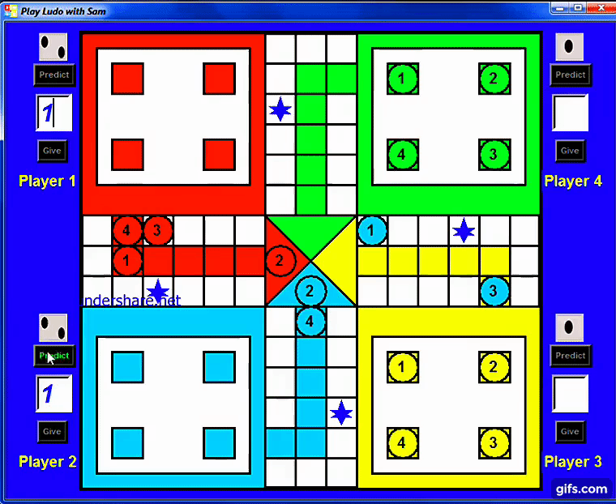

# 
 ❤️ Hello Developers ❤️ 

### 
  💡 _Now I am going to present you my New Game_ 💡 

###  
😲 _Yes, This is Ludo Game made by Python(Version 3) Tkinter_ 😲

---

### 
 💻 <i>_This is a Desktop App_</i> 💻

### 
 📌 Minimum Players to participate: 2 Players

### 
 📌 Maximum Players to participate: 4 Players

---
<h2 align="center"><b>💡 Some Important Links 💡</b></h2>

- ### [Click Here to See the Project Video](https://youtu.be/K6LHcfr1HMQ "LCO")

- ### [Follow Me on LinkedIn to Get Regular Project Updates](https://www.linkedin.com/in/samarpan-dasgupta-4aa1061b0/ "LCO")

<h2 align="center"><b>🧡 Thank You For Visiting 🙏, Have a Nice Day 🧡</b></h2>

